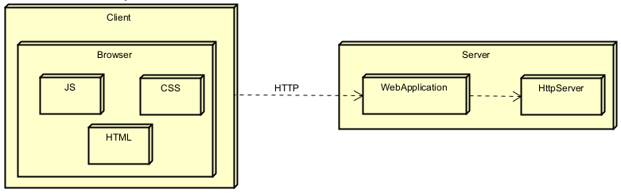

# Web Framework Development for REST Services and Static File Management

This project implements a framework that enables the development of web applications with backend REST services.
It provides developers tools to define REST services using lambda functions, manage query values within
requests, and specify the location of static files that will be used in the server.

## Getting Started

### Prerequisites

### 1. **Java Development Kit (JDK)**

- To check if Java is installed, run:

```
java -version
```

- If Java is not installed, download it from the official Oracle [website](https://www.oracle.com/co/java/technologies/downloads/).

### 2. **Maven**

- To check if Maven is installed, run:

```
mvn --version
```

- If Maven is not installed, download it from the official Apache Maven [website](https://maven.apache.org/download.cgi).

### 3. Git

- To check if Git is installed, run:

```
git --version
```

- If Git is not installed, download it from the official Git [website](https://git-scm.com/downloads).

### Installing

1. Clone the repository to your local machine using Git.

```
git clone https://github.com/SamuRoj/AREP_Taller_2.git
```

2. Navigate to the project directory.

```
cd AREP_Taller_2
```

3. Build the project by running the following command:

```
mvn clean install
```

4. Execute the project with the following command:

```
java -cp target/taller-2-1.0-SNAPSHOT.jar edu.escuelaing.arep.app.WebApplication
```

5. Once the server is running, open your web browser and visit:

```
http://localhost:23727/
```

## Features of the application

- A get() method that allows developers to define REST services using lambda functions.

    - To define a new function the main method of the WebApplication class has to be modified with a new call to
      the get() method and two parameters, the route of the function and the lambda expression.

  

    - To access it, the URL has to follow the next structure: `http://localhost:23727/app/+<routeAdded>`

  

    - There's already some services defined like "/app/hello", "/app/pi" and "/app/e"

- A mechanism to extract query parameters from incoming requests and make them accessible within the REST
  services.

    - The request of the petition has a method called getValues(), it receives a parameter, the name of the
      parameter that would be retrieved from the query made, to test it a request has to be made to the following
      URL: `http://localhost:23727/app/greeting?<parameter>=<value>&<parameter>=<value>...`
      The number of parameters can be any, but only one would be retrieved.

  

    - It's already configured to retrieve the parameter name.

  

    - To test another parameter it has to be changed in the method getValues() shown before. In case, the parameter
      doesn't exist, Not Found will be retrieved.

- A staticfiles() method that allows developers to define the folder where static files would be queried.

    - By default, this method has the route `/static` defined and every request made would be searched in this
      folder

  

    - The folder can be changed to /newFolder, which contains a basic HTML file. To verify the change, the
      staticfiles() method must be configured to use "/newFolder", and a request should be made to the
      URL http://localhost:23727/.

  
  

    - The REST services defined with the get() method will continue to be available.

- Query for static files located in the defined folder, to do this just add to the route of the page the name
  of the file like `http://localhost:23727/styles.css`, it can be made with any file that's located in the
  current folder.


- The main page contains a small app that allows the user to add his daily activities through requests methods
  like GET, POST and DELETE, it's made with HTML, CSS and JavaScript to make asynchronous petitions to the server
  and add new activities to it.


## Architecture

### Class Diagram


### Classes

- **HTTP Server:** It is responsible for serving the files requested by the client and processing the GET, POST,
  and DELETE requests it receives.
- **Web Application:** Starts the HTTP Server, defines some REST services through the get() method and sets up
  the folder where the files will be searched to `/static`.
- **HttpRequest:** Parses the query and the path of the request made and has a getValues() method to parse
  the parameters of the query and returns one of them if it exists.
- **Activity:** Works as a template to save the activities of the user.

### Deployment Diagram



### Overview

This diagram summarizes the interactions between the client and the HttpServer implementation.

### Components

- **HTML:** It is served through the HTTP server and allows the browser to render the web page.
- **CSS:** It is also served from the server and is responsible for styling the page.
- **JS:** It is served from the server and handles GET, POST, and DELETE requests to refresh the activity list
  on the page, while also keeping the server updated on any changes made.
- **HTTP Server:** It is responsible for serving the files requested by the client, processes the GET, POST,
  and DELETE requests it receives, changes the directory of the file and saves the REST services that has been
  added by the developer.
- **Web Application:** Works as a middleware to connect the HTTP Server and the client, it also defines some
  REST services and the start route where the files will be searched.
- **HttpRequest:** Parses the query and the path of the request made and has a getValues() method to parse
  the parameters of the query and returns one of them if it exists.

## Running the tests

- Execute them by running the following command:

```
mvn test
```

### HttpRequestTest

The tests in this file check the functionality of the method getValues() implemented in the class.

- Example of test:


- Image of the results:


### HttpServerTest

The tests in this file just verifies if the mime type of the file being queried it's the proper one and returns
a valid or invalid answer in case it doesn't exist.

- Example of test:


- Image of the results:


### WebApplicationTest

The tests in this file runs the application as a thread to check its connectivity and answers to different
requests for a file like index.html, script.js, styles.css and wallpaper.jpeg. It also verifies the tools to
define REST services with lambda functions by querying endpoints like `/app/hello`, `/app/pi`, `/app/e` and
`/app/greeting?name=Samuel`.

- Example of request for a file:

    - Starts and finish the server every time a test its executed.


- Finds the file locally and makes a query to the server to compare the responses.


- Example of request for a REST service defined with lambda:

    - It makes a request to an endpoint and asserts the answer it's the same as the one already defined.


- Image of the results:


## Built With

* [Java Development Kit](https://www.oracle.com/co/java/technologies/downloads/) - Software Toolkit
* [Maven](https://maven.apache.org/) - Dependency Management
* [Git](https://git-scm.com/) - Distributed Version Control System

## Authors

* **Samuel Rojas** - [SamuRoj](https://github.com/SamuRoj)

## License

This project is licensed under the GNU License - see the [LICENSE.txt](LICENSE.txt) file for details.